# Conos Walkthrough

- [Loading the Data](#loading-the-data)
  * [Pre-processing with pagoda2](#pre-processing-with-pagoda2)
  * [Pre-processing with Seurat](#pre-processing-with-seurat)
- [Integrating Datasets with conos](#integrating-datasets-with-conos)
  * [Changing embedding parameters](#changing-embedding-parameters)
    + [largeVis](#largevis)
    + [UMAP](#umap)
- [Exploring Hierarchical Community Structure](#exploring-hierarchical-community-structure)
  * [Using Shiny Application](#using-shiny-application)
- [Label Propagation](#label-propagation)
- [Differential Expression](#differential-expression)
  * [Cluster markers](#cluster-markers)
  * [Differential expression between sample groups](#differential-expression-between-sample-groups)
    + [Simple run](#simple-run)
- [Forcing Better Alignment](#forcing-better-alignment)

In this tutorial, we will go over the analysis of a panel of samples
using conos. Conos objects can be used to identify clusters of
corresponding cells across panels of samples from similar or dissimilar
sources, with different degrees of cell type overlap. Here we will
identify the clusters of corresponding cells across a panel of bone marrow (BM) and
cord blood (CB) by generating a joint graph with the cells from all the
samples. We will then use this graph to propagate labels from a single
labelled sample to other samples, and finally perform differential
expression between the BM and CB samples.

First, let’s load conos library:


```r
library(conos)
library(dplyr)
```

# Loading the Data

Next we will load a previously prepared panel of four samples, which you can access directly using the package [conosPanel](https://github.com/kharchenkolab/conosPanel) (See the README of conos for installation details): 


```r
install.packages('conosPanel', repos='https://kharchenkolab.github.io/drat/', type='source')
```

This panel was originally
made up of 16 cord blood and bone marrow samples, but for convenience, we will here focus on a smaller subset of just four samples: two samples with are bone marrow (BM), and two samples which are cord blood (CB). Each sample has been subset to a size of exactly 3000 cells. 

**Note:** When starting with your own panel, we
recommend filtering out low-count/poor-quality/dying cells, as is standard for quality control.


```r
panel <- conosPanel::panel
```

Let’s take a look at the panel. The panel is a named list of sparse
matrices (type `"dgCMatrix"`).


```r
str(panel, 1)
```

```
## List of 4
##  $ MantonBM1_HiSeq_1:Formal class 'dgCMatrix' [package "Matrix"] with 6 slots
##  $ MantonBM2_HiSeq_1:Formal class 'dgCMatrix' [package "Matrix"] with 6 slots
##  $ MantonCB1_HiSeq_1:Formal class 'dgCMatrix' [package "Matrix"] with 6 slots
##  $ MantonCB2_HiSeq_1:Formal class 'dgCMatrix' [package "Matrix"] with 6 slots
```

Before we continue, it is very important to make sure that cells in our
panel are uniquely named. No two cells (even in different samples)
should be named identically. In this case, the cells have been prefixed
by sample id, so there will not be any collisions. However, in most cases
you will have to prefix the cells before continuing.


```r
head(colnames(panel[[1]]))
```

```
## [1] "MantonBM1_HiSeq_1-TCTATTGGTCTCTCGT-1"
## [2] "MantonBM1_HiSeq_1-GAATAAGTCACGCATA-1"
## [3] "MantonBM1_HiSeq_1-ACACCGGTCTAACTTC-1"
## [4] "MantonBM1_HiSeq_1-TCATTTGGTACGCTGC-1"
## [5] "MantonBM1_HiSeq_1-TATTACCCAAAGGAAG-1"
## [6] "MantonBM1_HiSeq_1-CGCCAAGCATCTGGTA-1"
```


To quickly check that the cell names are unique, we can run:


```r
any(duplicated(unlist(lapply(panel,colnames))))
```

```
## [1] FALSE
```


Conos is focused on integration, and relies on either
[pagoda2](https://github.com/kharchenkolab/pagoda2) or
[Seurat](https://satijalab.org/seurat/) to perform dataset
pre-processing.

## Pre-processing with pagoda2

Given we'll primarily use pagoda2 for this walkthrough, please install the auxilliary package [p2data](https://github.com/kharchenkolab/p2data):


```r
install.packages('p2data', repos='https://kharchenkolab.github.io/drat/', type='source')
```

We will generate `Pagoda2` objects for poorly-expressed genes from each
individual sample using the `basicP2proc` helper function for quick
processing. As the datasets will be compared to each other, we will turn
off automated dropping of low-expressed genes (using `min.cells.per.gene=0`),
and lower the numbers of local principal components (PCs) estimated for faster processing. (For more details on `pagoda2`, please see the tutorial [here](https://github.com/kharchenkolab/pagoda2/blob/master/vignettes/pagoda2.walkthrough.md).)

We use `lapply()` here as `panel` is a list with 4 elements (i.e. a panel of four samples).

(Note: You could run the outer loop in parallel using `mclapply()`, however if executed within RStudio this sometimes causes multithreading problems. Also, multiprocessing must be disabled in order to obtain exactly the same individual sample embeddings from one run to another: this can be done by using `set.seed(1)` and specifying `n.cores=1` in the command below.)


```r
library(pagoda2)
panel.preprocessed <- lapply(panel, basicP2proc, n.cores=1, min.cells.per.gene=0, n.odgenes=2e3, get.largevis=FALSE, make.geneknn=FALSE)
```

```
## creating space of type angular done
## adding data ... done
## building index ... done
## querying ... done
## creating space of type angular done
## adding data ... done
## building index ... done
## querying ... done
## creating space of type angular done
## adding data ... done
## building index ... done
## querying ... done
## creating space of type angular done
## adding data ... done
## building index ... done
## querying ... done
```


Let’s look at the output of our processing: we now have a named list of
pagoda2 objects, which is the starting point for the analysis with
conos.


```r
typeof(panel.preprocessed)
```

```
## [1] "list"
```

```r
names(panel.preprocessed)
```

```
## [1] "MantonBM1_HiSeq_1" "MantonBM2_HiSeq_1" "MantonCB1_HiSeq_1"
## [4] "MantonCB2_HiSeq_1"
```

## Pre-processing with Seurat

Alternatively with Seurat, pre-processing can be done in a similar way
using an analogous `basicSeuratProc` helper function. If
you already have a set of Seurat objects (one per dataset), you can just
skip this step and feed them directly to `Conos$new()` as shown below.


```r
library(Seurat)
panel.preprocessed.seurat <- lapply(panel, basicSeuratProc)
```

We note that sample pre-processing steps can be used to filter/adjust
the data in custom ways. For instance, one can reduce the impact of the
cell cycle contributions by omitting cycle-annotated genes from the
matrices prior to the pre-processing. Similarly, if it is deemed
appropriate, one can regress out certain signatures using [standard
techniques](https://satijalab.org/seurat/v3.0/cell_cycle_vignette.html#regress-out-cell-cycle-scores-during-data-scaling). Please 
see the Seurat documentation for more [details](https://satijalab.org/seurat/).

# Integrating Datasets with conos

We will now construct a Conos object for this panel of samples. At this
point we haven’t calculated anything: we have just generated an object
that contains the samples. At this step, we also set the
`n.cores` parameter. Because the graph generation with conos can take advantage of
parallel processing, feel free to use as many physical cores as you have available
here.


```r
con <- Conos$new(panel.preprocessed, n.cores=1)
```

Our original pagoda2 (or Seurat) objects are now saved in the Conos
object.


### Build the Joint Graph

Next we will build the joint graph that encompasses all the samples. We
do this by pairwise projecting samples onto a common space and
establishing the k-nearest neighbors (kNN) of mutual nearest neighbor (mNN) pairs between the samples. We then append within-sample k-nearest neighbors to the graph to ensure that all of the cells
are included in the graph:

  - We use ‘PCA’ space here which is very fast and will yield good
    integration in most cases.
  - CPCA space should provide more accurate alignment under greater
    dataset-specific distortions.
  - CCA space optimizes conservation of correlation between datasets and
    can give yield very good alignments in low-similarity cases
    (e.g. large evolutionary distances).
  - If your datasets were all measured on the same platform you may also
    want to consider “genes” space which can give better resolution in
    such (simpler) cases.

The other parameters passed to the `buildGraph()` function below are all
default values, but are included for clarity:


```r
con$buildGraph(k=30, k.self=5, space='PCA', ncomps=30, n.odgenes=2000, matching.method='mNN', metric='angular', score.component.variance=TRUE, verbose=TRUE)
```

```
## .............
```


**Note:** As pairwise comparisons may take a while, conos will cache results
for each space. If you wish to recalculate PCA (as an example) using pairings
with different set of parameters (e.g. more components, different number
of starting over-dispersed genes, etc.), clear the cache first by doing
`con$pairs$PCA <- NULL`.

In the `$buildGraph()` invocation above, we specified
`score.component.variance=TRUE` which estimates the amount of variance
explained by successive PCs (by default this option is off to save
time). We can visualize the results using:


```r
plotComponentVariance(con, space='PCA')
```

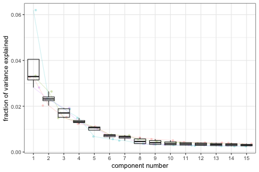


When using the ‘angular’ distance measure (default), it is NOT recommended to
reduce the number of components to a bare minimum indicated by the
“elbow” inflection point----rather, please include 10-20 more (typically 30 components
work well). For the ‘L2’ distance, using fewer components (i.e. at ‘elbow’
value) is sometimes better. (**NOTE:** Remember that if you want to
recalculate projections, clear the cache for that space as detailed above, i.e.
`con$pairs$PCA <- NULL`.)

We can now plot a panel of these samples using the clusters we have
identified by examining each sample on its own. Please note that each sample
has an independent set of clusters that bears no relation to
clusters in other samples. For example, notice the presence (and lack thereof) of cluster
9.


```r
con$plotPanel(clustering="multilevel", use.local.clusters=TRUE, title.size=6)
```

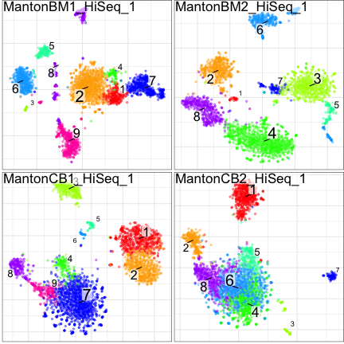

We next use the graph we identified to get the global clusters. Here we use the
Leiden community detection method to obtain clusters. Increasing the
value of the resolution parameter will result in more fine-grained
clusters, while decreasing it will return coarser clustering:


```r
con$findCommunities(method=leiden.community, resolution=1)
```

### Plot Clusters

We can now plot the clusters we obtained. Note that the number of clusters
between different samples now correspond to the same cell type. 


```r
con$plotPanel(font.size=4)
```

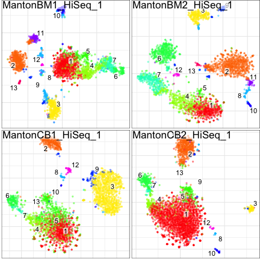


The convenience function `plotClusterBarplots` can be used to examine the composition of the
clusters in terms of samples (top), sample entropy (middle), and cluster size
(bottom):


```r
plotClusterBarplots(con, legend.height = 0.1)
```

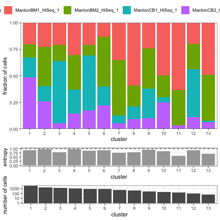


Next we can check the expression pattern of a specific gene across all the individual
embeddings. In this case, we investigate the expression pattern of [GZMK](https://www.ncbi.nlm.nih.gov/gene/3003):


```r
con$plotPanel(gene = 'GZMK')
```

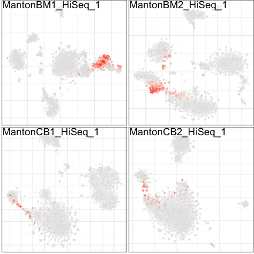

**Note:** If there are `NA` values in your input data, these will be plotted by default as a black "x" as opposed to a round dot if `plot.na=TRUE`. 

Let's see this behavior by setting values in the panel sample `MantonCB2_HiSeq_1` to `NA`:


```r
## create new variable for panel.preprocessed
preprocessed_panel_example <- panel.preprocessed
## set NAs within all cell sin MantonCB2_HiSeq_1
preprocessed_panel_example$MantonCB2_HiSeq_1$clusters$PCA$multilevel <- NA
## create new Conos object
con_example <- Conos$new(panel.preprocessed, n.cores=1)
## construct joint graph
con_example$buildGraph()
```

```
## .............
```

```r
## now plot the panel with NA values as "X"
con_example$plotPanel(clustering="multilevel", use.local.clusters=TRUE, title.size=6)
```

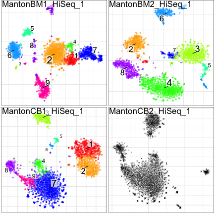

Notice how the `NA` values in the sample `MantonCB2_HiSeq_1` are plotted with black "x" symbols, in contrast to the original plot generated with `plotPanel()` above.


This behavior is fundamentally controlled by the function `embeddingPlot()` within the R package [sccore](https://github.com/kharchenkolab/sccore). When `plot.na=TRUE` (which is the default behavior), the value of the `shape` parameter in `ggplot2::geom_point` is set to `shape=4`, which creates these black `X` symbols for NA values. For more information, please refer to the ggplot2 documentation pages on [shape](https://ggplot2.tidyverse.org/articles/ggplot2-specs.html?q=shape#sec:shape-spec) and [geom_point](https://ggplot2.tidyverse.org/reference/geom_point.html), as well as `?sccore::embeddingPlot`.
 

### Generate Embedding and Visualize

Next we generated an embedding of the joint graph, and then visualize the complete joint graph. First, the embedding (whereby the default uses 'largeVis'):


```r
con$embedGraph(method='largeVis')
```

```
## Estimating embeddings.
```
And now we can create the visualization:


```r
con$plotGraph(alpha=0.1)
```

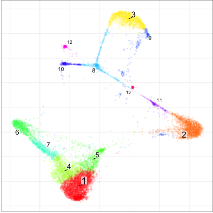

Both functions `$plotGraph` and `$plotPanel` are constructed off of the
main function `sccore::embeddingPlot` and will pass all visualization parameters
to this main function. So, to get full list of the possible parameters please refer to
`?sccore::embeddingPlot` and the examples below.

**Note:** In previous versions of `conos` (<=1.3.1), an embedding estimation would automatically run by default with `$plotGraph()`, without users having to explicitly use `$embedGraph()`. This has changed, and `$embedGraph()` must be called by the user. Please see the
`$embedGraph` function for additional embedding options.


Observe that the graph captures the population structure irrespective
of the sample of origin for each cell:


```r
con$plotGraph(color.by='sample', mark.groups=FALSE, alpha=0.1, show.legend=TRUE)
```

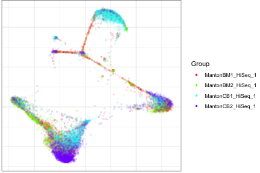


We can also visualize gene expression on this joint graph embedding, again using [GZMK](https://www.ncbi.nlm.nih.gov/gene/3003) as an example:


```r
con$plotGraph(gene='GZMK', title='GZMK expression')
```

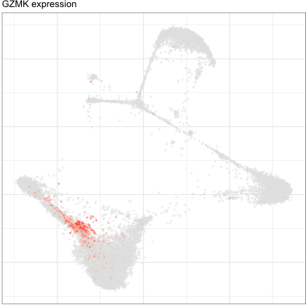


Other community detection methods can provide a more sensitive and
hierarchical view of the subpopulation structure. Here we run the [igraph walktrap
community](https://www.rdocumentation.org/packages/igraph/versions/0.5.1/topics/walktrap.community) detection method on the same joint graph:


```r
con$findCommunities(method = igraph::walktrap.community, steps=7)
```

**Note:** We recommend using a higher number of steps (e.g. 8-10,
though these calculations take much longer). Here we’ll get a lot of smaller clusters. 

**Note:** Different clustering results are kept as a simple list under `con$clusters`.

Now let's visualize these new clusters:


```r
con$plotPanel(clustering='walktrap', font.size=4)
```

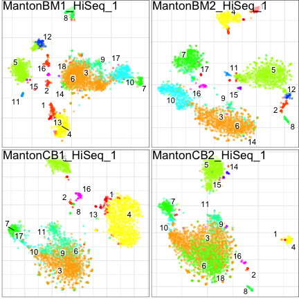

And here is the new clustering, as viewed on a joint graph:


```r
con$plotGraph(clustering='walktrap')
```

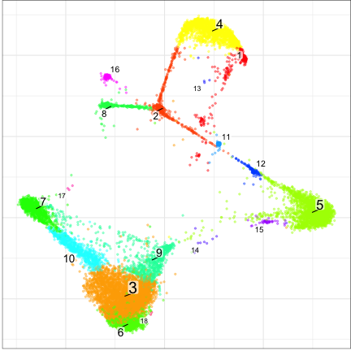


## Changing embedding parameters

Conos is currently able to use two methods of graph embedding:
[largeVis](https://github.com/lferry007/LargeVis) (default) and
[UMAP](https://github.com/jlmelville/uwot). The UMAP embedding takes a bit longer
to estimate, but will generally give a better quality of the embedding, i.e.
sometimes UMAP will distinguish the slightest difference (which is not detected by
either largeVis or even clustering algorithms). It is best to examine both types of embeddings.

### largeVis

For the description of largeVis parameters, please look at the
`conos::projectKNNs` function. The most influential are `alpha` and
`sgd_batches`. Decreasing alpha results in less compressed clusters, and
increasing `sgd_batches` often helps to avoid cluster intersections and the
spreading out of clusters. Here we take `alpha` to a very low value, for the
sake of example:


```r
con$embedGraph(alpha=0.001, embedding.name="example_embedding", sgd_batched=1e8)  
```

Note that we are specifically naming this embedding with the parameter `embedding.name`. Multiple embeddings can be named and retrieved using these names. (By default, if not specified, the last embedding generated is accessed by functions which use the embedding, e.g. plotting.)


```r
con$plotGraph(clustering='walktrap', size=0.1)
```

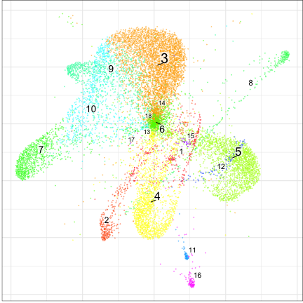

### UMAP

The UMAP embedding supports all parameters, as described in the
[uwot](https://github.com/jlmelville/uwot) package. The two most important
ones are `spread` and `min.dist`, which together control how tight the
clusters are. According to the [python
manual](https://umap-learn.readthedocs.io/en/latest/api.html):

>   - **min.dist:** The effective minimum distance between embedded
>     points. Smaller values will result in a more clustered/clumped
>     embedding where nearby points on the manifold are drawn closer
>     together, while larger values will result on a more even dispersal
>     of points. The value should be set relative to the spread value,
>     which determines the scale at which embedded points will be spread
>     out.
>   - **spread:** The effective scale of embedded points. In combination
>     with min\_dist this determines how clustered/clumped the embedded
>     points are.
There is also a parameter responsible for the trade-off between performance
and accuracy: 

> - **min.prob.lower:** minimal probability of hitting a neighbor, after which the random walk stops. Default: 1e-7.

```r
con$embedGraph(method="UMAP", min.dist=0.01, spread=15, min.prob.lower=1e-3)
```

```
## Estimating hitting distances: 01:59:51.
## Done.
## Estimating commute distances: 02:00:00.
## Hashing adjacency list: 02:00:00.
## Done.
## Estimating distances: 02:00:02.
## Done
## Done.
## All done!: 02:00:08.
```


```r
con$plotGraph(clustering='walktrap', size=0.1)
```

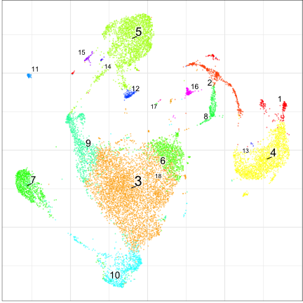


In the example above, the UMAP layout distinguishes many of the very small
subpopulations called by walktrap apparent.

### plotPanel with common embedding

Now we can use this common embedding in `plotPanel` as well:


```r
con$plotPanel(clustering='walktrap', size=0.1, use.common.embedding=TRUE)
```

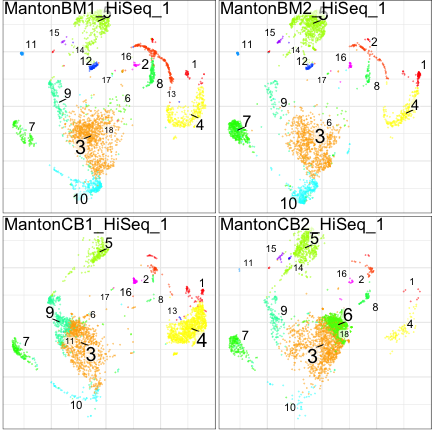


## Exploring Hierarchical Community Structure


Walktrap clustering generates a hierarchical community structure. Let's being by taking a cut of the top dendrogram and visualizing it. Here we’ll take the 40 top clusters.


```r
fc <- greedyModularityCut(con$clusters$walktrap$result, 40)
```

The cut determines a finer clustering (likely overclustering) of the
dataset on its leafs:


```r
con$plotGraph(groups=fc$groups, size=0.1)
```

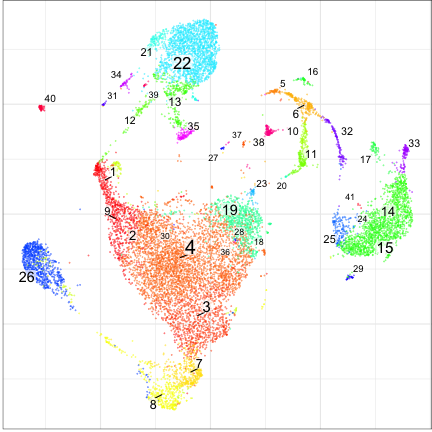


Let’s look at the hierarchical structure of these
clusters:


```r
# fc$hc is an hclust structure ... here we will convert it to a dendrogram
dend <- as.dendrogram(fc$hc)
plot(dend)
```

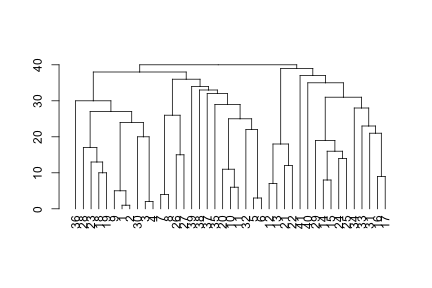


### Using Shiny Application

One way to explore this the hierarchical community structure is by
using an interactive app `conosViz`, currently found at https://github.com/kharchenkolab/conosViz. The app also allows users to visualize tissue
composition and sample similarities.


## Label Propagation

One of the uses of this graph is to propagate labels. For example, in
some cases we will only have information about the cell types in one of
the samples and we will want to automatically label the other samples.

We’ll load the annotation from a simple text file (first column giving the cell
name, second giving the cell type), and make a named factor out of
it:


```r
cellannot <- read.table(file.path(find.package('conos'), 'extdata', 'cellannot.txt'), header=FALSE, sep='\t')
cellannot <- setNames(cellannot[,2], cellannot[,1])
```

Next we plot our panel with the annotations we made. This is to verify
that the annotated cells are indeed in only one sample and that the
other samples are unlabelled.


```r
con$plotPanel(groups = cellannot)
```

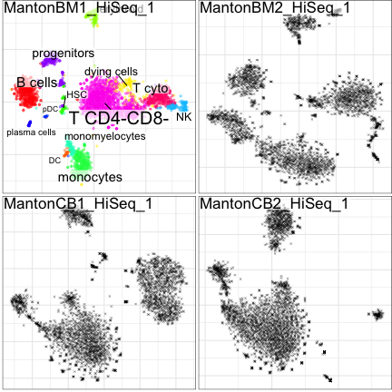

Next let’s propagate the labels from the one annotated sample to the
other samples.


```r
new.label.info <- con$propagateLabels(labels = cellannot, verbose=TRUE)
```

```
## Stop after 23 iterations. Norm: 0.0240659
## Min weight: 1.67017e-05, max weight: 0.367879, fading: (10, 0.1)
```

This function returns probabilities, uncertainty scores, and final labels
in the dataset of each cell belonging to each
group:


```r
con$plotPanel(colors=new.label.info$uncertainty, show.legend=TRUE, legend.title="Uncertainty", legend.pos=c(1, 0))
```

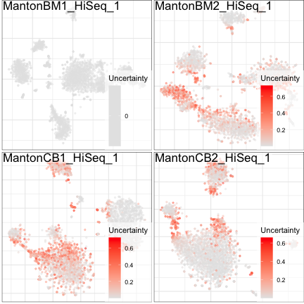

```r
con$plotPanel(groups=new.label.info$labels, show.legend=FALSE)
```

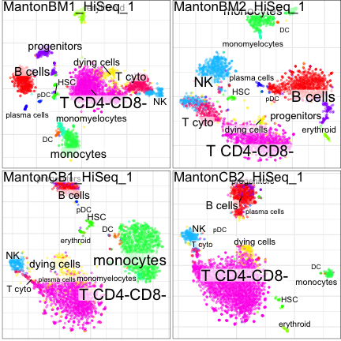


```r
head(new.label.info$label.distribution)
```

```
##                                        T CD4-CD8-  progenitors      B cells
## MantonBM1_HiSeq_1-GGAACTTCACTGTCGG-1 0.000000e+00 0.000000e+00 0.000000e+00
## MantonBM2_HiSeq_1-CTGATAGAGCGTTCCG-1 2.537137e-06 3.334654e-09 8.610231e-11
## MantonBM1_HiSeq_1-ACTGATGGTGGTGTAG-1 0.000000e+00 0.000000e+00 0.000000e+00
## MantonBM1_HiSeq_1-GGACATTTCCAAACTG-1 0.000000e+00 0.000000e+00 0.000000e+00
## MantonBM1_HiSeq_1-TCATTACAGACAAAGG-1 0.000000e+00 0.000000e+00 0.000000e+00
## MantonBM1_HiSeq_1-GATCGCGGTTGATTCG-1 0.000000e+00 0.000000e+00 0.000000e+00
##                                                NK    T cyto    monocytes
## MantonBM1_HiSeq_1-GGAACTTCACTGTCGG-1 0.0000000000 1.0000000 0.000000e+00
## MantonBM2_HiSeq_1-CTGATAGAGCGTTCCG-1 0.0003790067 0.9996182 6.742431e-14
## MantonBM1_HiSeq_1-ACTGATGGTGGTGTAG-1 0.0000000000 1.0000000 0.000000e+00
## MantonBM1_HiSeq_1-GGACATTTCCAAACTG-1 1.0000000000 0.0000000 0.000000e+00
## MantonBM1_HiSeq_1-TCATTACAGACAAAGG-1 0.0000000000 1.0000000 0.000000e+00
## MantonBM1_HiSeq_1-GATCGCGGTTGATTCG-1 0.0000000000 1.0000000 0.000000e+00
##                                      monomyelocytes plasma cells  dying cells
## MantonBM1_HiSeq_1-GGAACTTCACTGTCGG-1   0.000000e+00 0.000000e+00 0.000000e+00
## MantonBM2_HiSeq_1-CTGATAGAGCGTTCCG-1   4.608396e-08 2.171145e-11 1.738202e-07
## MantonBM1_HiSeq_1-ACTGATGGTGGTGTAG-1   0.000000e+00 0.000000e+00 0.000000e+00
## MantonBM1_HiSeq_1-GGACATTTCCAAACTG-1   0.000000e+00 0.000000e+00 0.000000e+00
## MantonBM1_HiSeq_1-TCATTACAGACAAAGG-1   0.000000e+00 0.000000e+00 0.000000e+00
## MantonBM1_HiSeq_1-GATCGCGGTTGATTCG-1   0.000000e+00 0.000000e+00 0.000000e+00
##                                         erythroid          HSC          pDC
## MantonBM1_HiSeq_1-GGAACTTCACTGTCGG-1 0.000000e+00 0.000000e+00 0.000000e+00
## MantonBM2_HiSeq_1-CTGATAGAGCGTTCCG-1 5.069632e-10 1.127039e-10 1.093938e-12
## MantonBM1_HiSeq_1-ACTGATGGTGGTGTAG-1 0.000000e+00 0.000000e+00 0.000000e+00
## MantonBM1_HiSeq_1-GGACATTTCCAAACTG-1 0.000000e+00 0.000000e+00 0.000000e+00
## MantonBM1_HiSeq_1-TCATTACAGACAAAGG-1 0.000000e+00 0.000000e+00 0.000000e+00
## MantonBM1_HiSeq_1-GATCGCGGTTGATTCG-1 0.000000e+00 0.000000e+00 0.000000e+00
##                                                DC
## MantonBM1_HiSeq_1-GGAACTTCACTGTCGG-1 0.000000e+00
## MantonBM2_HiSeq_1-CTGATAGAGCGTTCCG-1 1.867634e-14
## MantonBM1_HiSeq_1-ACTGATGGTGGTGTAG-1 0.000000e+00
## MantonBM1_HiSeq_1-GGACATTTCCAAACTG-1 0.000000e+00
## MantonBM1_HiSeq_1-TCATTACAGACAAAGG-1 0.000000e+00
## MantonBM1_HiSeq_1-GATCGCGGTTGATTCG-1 0.000000e+00
```

# Differential Expression

## Cluster markers

The first step we can do to understand meaning of the dataset is to look
at the cluster cell markers:


```r
new.annot <- new.label.info$labels
de.info <- con$getDifferentialGenes(groups=new.annot, append.auc=TRUE)
```

```
## Estimating marker genes per sample
```

```
## 
  |                                                              |   0%, ETA NA
  |===============                                            |  25%, ETA 00:02
  |==============================                             |  50%, ETA 00:02
  |============================================               |  75%, ETA 00:01
  |=======================================================| 100%, Elapsed 00:04
```

```
## Aggregating marker genes
```

```
## 
  |                                                              |   0%, ETA NA
  |=====                                                      |   8%, ETA 00:02
  |=========                                                  |  15%, ETA 00:01
  |==============                                             |  23%, ETA 00:01
  |==================                                         |  31%, ETA 00:01
  |=======================                                    |  38%, ETA 00:01
  |===========================                                |  46%, ETA 00:01
  |================================                           |  54%, ETA 00:01
  |====================================                       |  62%, ETA 00:01
  |=========================================                  |  69%, ETA 00:00
  |=============================================              |  77%, ETA 00:00
  |==================================================         |  85%, ETA 00:00
  |======================================================     |  92%, ETA 00:00
  |=======================================================| 100%, Elapsed 00:01
```

```
## Estimating specificity metrics
```

```
## 
  |                                                              |   0%, ETA NA
  |=====                                                      |   8%, ETA 00:52
  |=========                                                  |  15%, ETA 00:25
  |==============                                             |  23%, ETA 00:23
  |==================                                         |  31%, ETA 00:30
  |=======================                                    |  38%, ETA 00:23
  |===========================                                |  46%, ETA 00:24
  |================================                           |  54%, ETA 00:19
  |====================================                       |  62%, ETA 00:16
  |=========================================                  |  69%, ETA 00:11
  |=============================================              |  77%, ETA 00:08
  |==================================================         |  85%, ETA 00:05
  |======================================================     |  92%, ETA 00:03
  |=======================================================| 100%, Elapsed 00:34
```

```
## All done!
```


```r
head(de.info$`B cells`)
```

```
##              Gene        M        Z        PValue          PAdj       AUC
## CD74         CD74 1.789081 30.80356 3.620609e-207 1.219928e-202 0.7299556
## HLA-DRA   HLA-DRA 1.979156 28.95478 3.541451e-183 1.193221e-178 0.8681325
## HLA-DPA1 HLA-DPA1 2.170884 27.27370 1.188189e-162 4.003247e-158 0.8710053
## CD79A       CD79A 2.368081 27.24539 2.570550e-162 8.660439e-158 0.9068872
## HLA-DPB1 HLA-DPB1 2.110922 27.03211 8.391264e-160 2.827017e-155 0.8721696
## HLA-DRB1 HLA-DRB1 1.948719 26.18603 5.026161e-150 1.693263e-145 0.8557757
##          Specificity Precision ExpressionFraction
## CD74       0.4629829 0.2442885          0.9971910
## HLA-DRA    0.7625913 0.4158677          0.9747191
## HLA-DPA1   0.8344894 0.4853206          0.9101124
## CD79A      0.9169311 0.6492083          0.8983146
## HLA-DPB1   0.8230977 0.4729574          0.9235955
## HLA-DRB1   0.8016386 0.4412164          0.9129213
```


```r
cowplot::plot_grid(con$plotGraph(groups=new.annot), con$plotGraph(gene="CD74"))
```

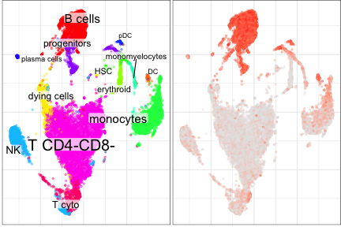


In addition, `getDifferentialGenes` estimates
[specificity](https://en.wikipedia.org/wiki/Sensitivity_and_specificity),
[precision](https://en.wikipedia.org/wiki/Precision_and_recall) and
expression fraction (sum expression of the gene within the cluster
divided by the total expression of this gene). If the `append.auc` flag is
set, it can estimate [ROC
AUC](https://en.wikipedia.org/wiki/Receiver_operating_characteristic#Area_under_the_curve),
but it can take some time. To find the most meaningful markers, it’s
recommended to filter the data by some lower value for the AUC and then
order the results by Z-score or
precision.


```r
de.info$monocytes %>% filter(AUC > 0.75) %>% arrange(-Precision) %>% head()
```

```
##                        Gene        M        Z        PValue          PAdj
## CD14                   CD14 3.226999 15.42978  7.996969e-53  2.685462e-48
## SERPINA1           SERPINA1 3.218886 21.05319  2.255639e-97  7.590001e-93
## RAB31                 RAB31 3.074515 13.79722  1.836815e-42  6.163985e-38
## CSTA                   CSTA 3.115659 23.84884 1.243703e-124 4.188294e-120
## FCN1                   FCN1 3.164729 26.65963 1.847622e-155 6.223716e-151
## RP11-1143G9.4 RP11-1143G9.4 2.621482 18.49146  2.243326e-75  7.541612e-71
##                     AUC Specificity Precision ExpressionFraction
## CD14          0.7691389   0.9915132 0.9076621          0.5473934
## SERPINA1      0.8829085   0.9832366 0.8807462          0.7831754
## RAB31         0.7834741   0.9844757 0.8520761          0.5835308
## CSTA          0.9103738   0.9759765 0.8488995          0.8453791
## FCN1          0.9508512   0.9707518 0.8375067          0.9312796
## RP11-1143G9.4 0.8535018   0.9764050 0.8294157          0.7316351
```


```r
con$plotGraph(gene="CD14")
```

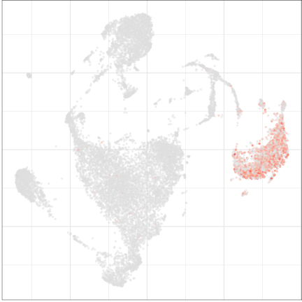


Or we can plot a heatmap of the top genes (top by AUC, by
default)


```r
plotDEheatmap(con,as.factor(new.annot),de.info, n.genes.per.cluster = 5, column.metadata=list(samples=con$getDatasetPerCell()), row.label.font.size = 7)
```

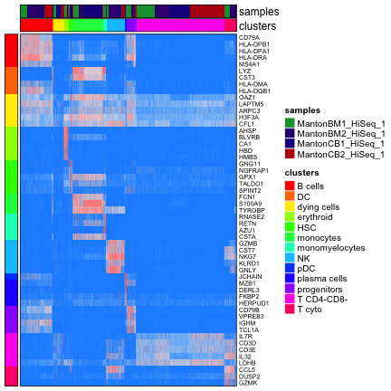


Here we make a smaller heatmap, selecting a subset of cell types and showing
only a hand-picked set of
genes:


```r
gns <- c("GZMB","IL32","CD3E","LYZ","HLA-DRA","IGHD","GNLY","IGHM","GZMK")
plotDEheatmap(con,new.annot,de.info[-c(3,10)], n.genes.per.cluster = 30, column.metadata=list(samples=con$getDatasetPerCell()), row.label.font.size = 7, labeled.gene.subset = gns)
```

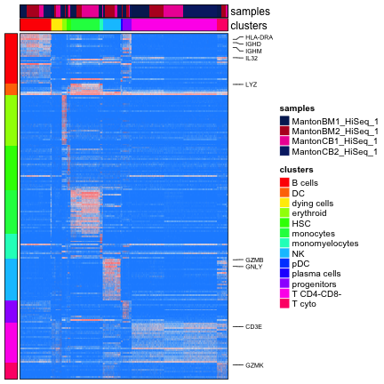


## Differential expression between sample groups

Next, given a joint clustering of cells that captures the cell relationships
between samples, we can want to ask what is different between the cells
of these populations between specific samples types (in this case, between CB and
BM samples). Conos provides routines for users to do that.

The general approach we suggest for differential expression analysis is
to first pool all the data associated with each cluster (forming a
meta-cell that is analogous bulk RNA-seq measurement of the cells within
each cluster), and then use standard differential expression packages (such as DESeq2 or limma) to compare these “bulk-like” meta-cell samples,
using appropriate design models. In this section we show a convenience
routine called `getPerCellTypeDE` that enables one type of comparison (same
cluster, between sample groups); if however more advanced models are desired
(e.g. additional model variables, etc.), the `getClusterCountMatrices`
command can be used to obtain the meta-cell counts:


```r
str(con$getClusterCountMatrices(), 1)
```

```
## List of 4
##  $ MantonBM1_HiSeq_1: num [1:33694, 1:15] 0 0 0 1 0 0 0 0 55 6 ...
##   ..- attr(*, "dimnames")=List of 2
##  $ MantonBM2_HiSeq_1: num [1:33694, 1:15] 0 0 0 0 0 0 0 0 98 6 ...
##   ..- attr(*, "dimnames")=List of 2
##  $ MantonCB1_HiSeq_1: num [1:33694, 1:15] 0 0 0 0 0 0 0 0 95 6 ...
##   ..- attr(*, "dimnames")=List of 2
##  $ MantonCB2_HiSeq_1: num [1:33694, 1:15] 0 0 0 0 0 0 0 0 168 21 ...
##   ..- attr(*, "dimnames")=List of 2
```

The list above returns a pooled count matrix for each sample, where the
rows are genes and the columns are clusters. A different value for the `groups` parameter can
be supplied.

Back to DE analysis of the cluster states between groups of samples:
First we need to define our sample groups


```r
samplegroups <- list(
  bm = c("MantonBM1_HiSeq_1","MantonBM2_HiSeq_1"),
  cb = c("MantonCB1_HiSeq_1","MantonCB2_HiSeq_1")
)
```

### Simple run

We can then run differential expression between cells in these sample
groups:


```r
de.info <- getPerCellTypeDE(con, groups=as.factor(new.annot), sample.groups = samplegroups, ref.level='bm', n.cores=1)
```

…and examine the output:


```r
str(de.info[1:3], 2)
```

```
## List of 3
##  $ B cells    :List of 3
##   ..$ res          :'data.frame':	15654 obs. of  6 variables:
##   ..$ cm           : num [1:33694, 1:4] 0 0 0 1 0 0 0 0 22 1 ...
##   .. ..- attr(*, "dimnames")=List of 2
##   ..$ sample.groups:List of 2
##  $ DC         : logi NA
##  $ dying cells:List of 3
##   ..$ res          :'data.frame':	13627 obs. of  6 variables:
##   ..$ cm           : num [1:33694, 1:4] 0 0 0 0 0 0 0 0 9 1 ...
##   .. ..- attr(*, "dimnames")=List of 2
##   ..$ sample.groups:List of 2
```


Let’s look at the results for the B cells:


```r
res <- de.info[['B cells']]$res
head(res[order(res$padj,decreasing = FALSE),])
```

```
##                baseMean log2FoldChange     lfcSE      stat       pvalue
## RP11-386I14.4 633.38462       3.613079 0.2969072 127.78732 1.249391e-29
## HBG2          166.84122       8.539809 1.1350814 113.51489 1.664267e-26
## IGHA1          94.25114      -6.194636 0.7613270  92.59274 6.424274e-22
## AL928768.3     86.15445      -6.442399 0.8464293  86.09567 1.714378e-20
## HBA2          432.96164       3.383313 0.3732523  71.23971 3.163558e-17
## CH17-373J23.1 434.14568       3.384284 0.3872119  66.31001 3.852979e-16
##                       padj
## RP11-386I14.4 1.955796e-25
## HBG2          1.302622e-22
## IGHA1         3.352186e-18
## AL928768.3    6.709220e-17
## HBA2          9.904469e-14
## CH17-373J23.1 1.005242e-12
```

# Forcing Better Alignment

As can be seen from the sample distribution plot, different samples (in
particular, those representing different tissues, i.e. BM or CB in our case) form separate
subclusters within the clusters of major cell types. Conos allows users to
force better alignment through i) adjustment of the `alignment.strength
parameter`, and ii) through rebalancing of edge weights based on a
specific factor (e.g. tissue to which the cell belongs) using the
`balance.edge.weights`
parameter.


```r
con$buildGraph(k=15, k.self=5, alignment.strength=0.3, space='PCA', ncomps=30, n.odgenes=2000, matching.method='mNN', metric='angular', score.component.variance=TRUE, verbose=TRUE)
```

```
## .......
```


We can re-generate the embedding and visualize the sample distribution
again:


```r
con$embedGraph(embedding.name="new_embedding")
con$plotGraph(color.by='sample', mark.groups=FALSE, alpha=0.1, show.legend=TRUE)
```

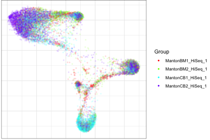


We can also check the entropy, as described above:


```r
con$findCommunities()
plotClusterBarplots(con, legend.height = 0.1)
```

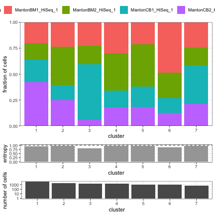

For more details on this topic, please see the tutorial [Adjustment of Alignment Strength with conos](https://github.com/kharchenkolab/conos/blob/master/vignettes/adjust_alignment_strength.md).

# View Conos in Pagoda2 Application

Users may also interactively explore Conos objects in the [Pagoda2](https://github.com/kharchenkolab/pagoda2) application. The process is very similar to the Pagoda2 walkthrough. 

After constructing the `con` object as shown above, users can save to a serialized `*.bin` file and upload into the pagoda application with the `p2app4conos()` function, using `p2app4conos(conos=con)`. More information, please review the Pagoda2 [walkthrough](https://github.com/kharchenkolab/pagoda2/blob/master/vignettes/pagoda2.walkthrough.md)


```r
# library(pagoda2)
# p2app = p2app4conos(conos=con, file="conosApp1.bin", save=TRUE)
# show.app(app=p2app, name='conos_app')
```


